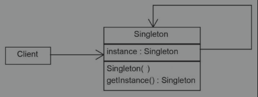
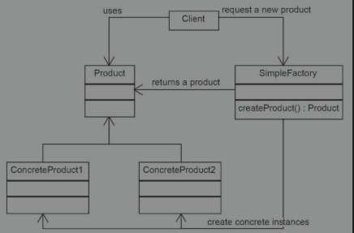
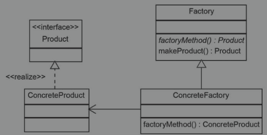
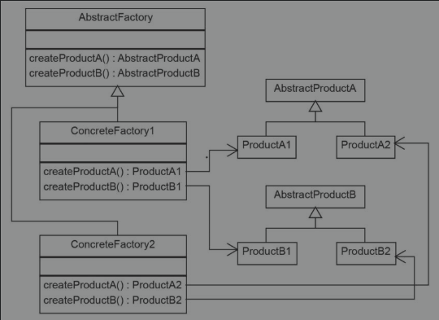

# 创建型模式
[单例模式]
[工厂模式]
[建造者模式]
[原型模式]
[对象池模式]

1. 单例模式

特点：一个对象只能创建一个实例
实现方式：一般的实现是将构造器私有，然后创建一个静态的单例，构建一个返回单例的方法。
优点：
缺点：
实际应用：Spring中的Bean默认是单例模式，sun.misc.Launcher
note: 在使用懒加载的方式时，注意对象创建的同步问题

2. 工厂模式
特点： 创建对象不通过new直接创建，而是通过工厂类获取
实现方式： 创建一个工厂类，在工厂类中创建获取特定对象的方法（一般为静态方法）
优点： 将对象的创建逻辑从使用对象的类中独立出来。降低耦合
缺点：
实际应用：Spring的BeanFactory，线程池的线程工厂。

3. 建造者模式
特点：可以通过建造者类，定制对象
实现方式：对于特定的对象，创建一个建造者，建造者中有一系列的方法，每个方法可以定制产生对象的一部分，最后通过build返回
优点：可以将一个复杂对象的过程简化，并且容易扩展
缺点：
实际应用： java.lang.StringBuilder

4. 原型模式
特点： 复制一个对象
实现方式：
优点：
缺点：
实际应用：

4. 对象池模式
特点： 复制一个对象
实现方式：
优点：
缺点：
实际应用：
