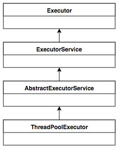
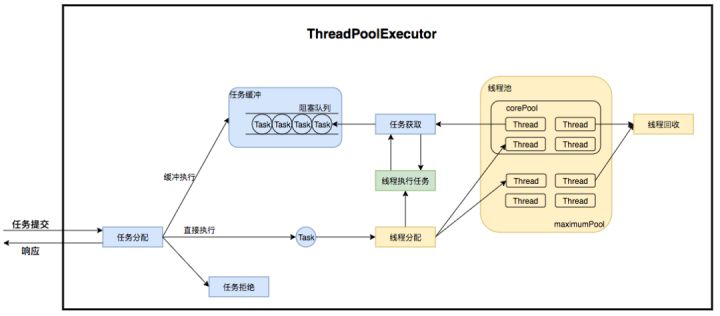
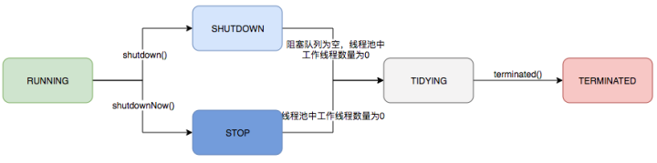
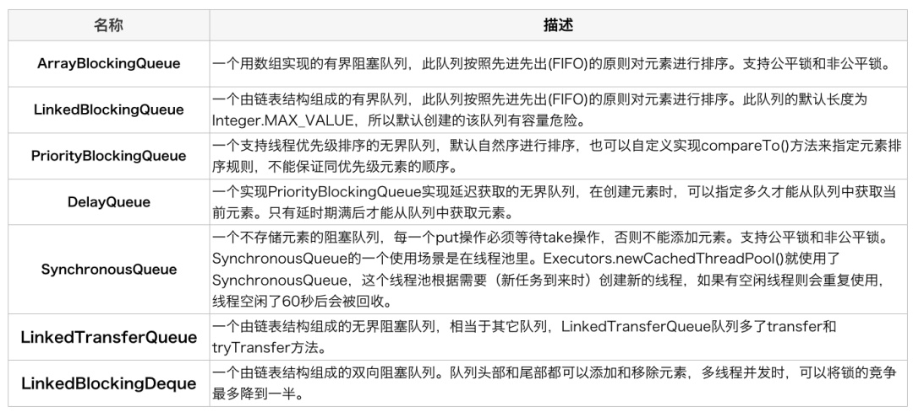

### 线程池

### 优点
1. **降低资源消耗**：通过池化技术重复利用已创建的线程，降低线程创建和销毁造成的损耗。
2. **提高响应速度**：任务到达时，无需等待线程创建即可立即执行。
3. **提高线程的可管理性**：线程是稀缺资源，如果无限制创建，不仅会消耗系统资源，还会因为线程的不合理分布导致资源调度失衡，降低系统的稳定性。使用线程池可以进行统一的分配、调优和监控。
4. **其它**：线程池具备可拓展性，允许开发人员向其中增加更多的功能。比如延时定时线程池ScheduledThreadPoolExecutor，就允许任务延期执行或定期执行

[参考美团技术博客](https://zhuanlan.zhihu.com/p/123328822)
### ThreadPoolExecutor

> Executor 将任务的提交与执行解耦  
> ExecutorService （1）扩充执行任务的能力，补充可以为一个或一批异步任务生成Future的方法；（2）提供了管控线程池的方法，比如停止线程池的运行。  
> AbstractExecutorService 将执行任务的流程串联了起来，保证下层的实现只需关注一个执行任务的方法即可。  
> ThreadPoolExecutor 一方面维护自身的生命周期，另一方面同时管理线程和任务，使两者良好的结合从而执行并行任务。  

ThreadPoolExecutor的运行状态  

运行状态 | 状态描述
---- | ----  
RUNNING | 能接受新提交的任务，并且也能处理阻塞队列中的任务   
SHUTDOWN | 关闭状态，不再接收新提交的任务，但却可以继续处理阻塞队列中已保存的任务   
STOP | 不能接收新任务，也不处理队列中的任务，会中断正在处理任务的线程
TIDYING | 所有任务都已终止，workerCount(有效线程数)为0
TERMINATED | 在terminated()方法执行完后进入该状态

1. 首先检测线程池运行状态，如果不是RUNNING，则直接拒绝，线程池要保证在RUNNING的状态下执行任务。
2. 如果workerCount < corePoolSize，则创建并启动一个线程来执行新提交的任务。
3. 如果workerCount >= corePoolSize，且线程池内的阻塞队列未满，则将任务添加到该阻塞队列中。
4. 如果workerCount >= corePoolSize && workerCount < maximumPoolSize，且线程池内的阻塞队列已满，则创建并启动一个线程来执行新提交的任务。
5. 如果workerCount >= maximumPoolSize，并且线程池内的阻塞队列已满, 则根据拒绝策略来处理该任务, 默认的处理方式是直接抛异常

### 总结
Java使用线程池管理线程有很多的优点，防止随意创建线程导致线程过多，从而影响性能。还能够方便线程的管理。  
线程池的管理类似于一个消费者和生产者模型。execute()方法创建任务，内部的addWorker()消耗任务（通过创建线程的方式）。  
线程池的重要参数，核心线程数，会一直存在。最大线程数，最大同时存在的线程数。线程等待存活时间，在getTask()中起作用。BlockingQueue，阻塞队列，用于存放任务的，不同阻塞队列会有不同的表现。ThreadFactory新建线程用，当需要新建一个线程时，会调用线程工厂的方法。RejectedExecutionHandler当发生无法添加任务时的处理策略。
